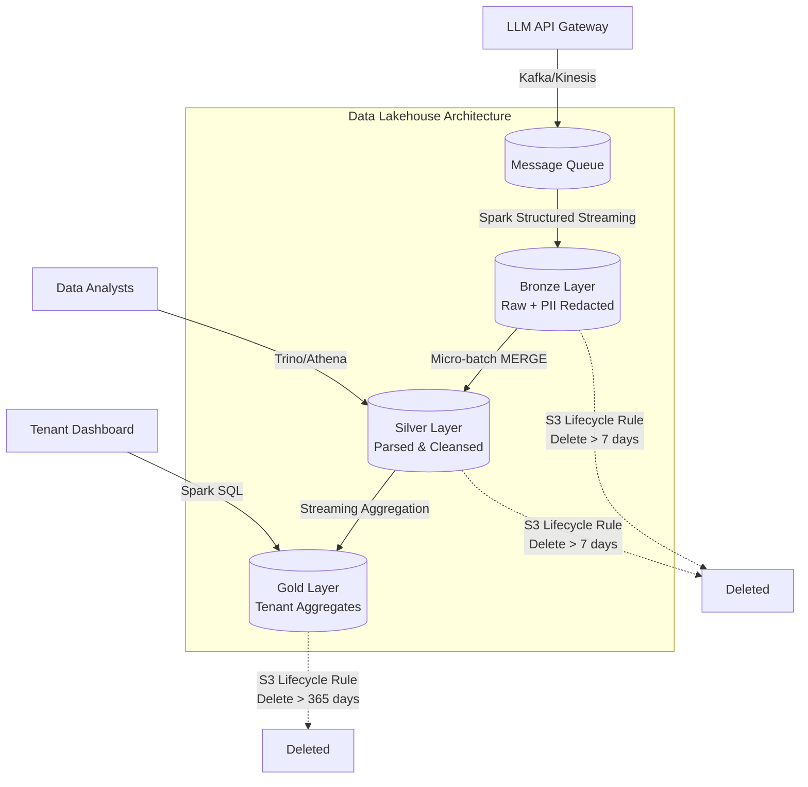

# Architecture Brief: LLM Observability at 1B Requests/Day

## 1. Problem Statement

Hệ thống cung cấp API cho Foundation Model với traffic cực lớn: **1 tỷ requests mỗi ngày**. Kích thước trung bình mỗi request/response là ~5 KB, dẫn đến dung lượng raw data sinh ra mỗi ngày là **5 TB**. 

**Yêu cầu và Ràng buộc:**
1. **SLA Dashboard**: Tính toán cost và latency theo từng `tenant_id`, refresh mỗi 5 phút.
2. **Lifecycle**: Giữ lại dữ liệu raw (prompt/response đầy đủ) trong đúng 7 ngày để điều tra sự cố (incident review). Sau 7 ngày, chỉ giữ lại bảng aggregated cho báo cáo năm (1 năm).
3. **Bảo mật**: Thông tin cá nhân (PII) phải được làm mờ (redact) ngay trước khi bất kỳ ai (như data analyst hay support) có thể đọc được.
4. **Ngân sách**: Tổng chi phí lưu trữ và tính toán phải ≤ **$5,000/tháng**.

Bởi quy mô 5TB/ngày là không nhỏ, hệ thống đòi hỏi một kiến trúc Lakehouse tối ưu chi phí, hỗ trợ streaming, xử lý PII tức thời và vòng đời (lifecycle) chặt chẽ.

---

## 2. Architecture Diagram

- **Bronze**: Dữ liệu đáp thẳng từ Kafka, append-only. PII text được mã hoá hoặc redact ngay lúc ingest bằng UDF.
- **Silver**: Dữ liệu parse JSON thành columnar, loại bỏ các event lỗi. Partition theo ngày, Z-Order theo `tenant_id`.
- **Gold**: Bảng tổng hợp theo từng khoảng thời gian 5 phút (tính latency p50, p95, cost).

---

## 3. Quyết định Kiến trúc & Trade-offs

Dưới đây là 5 quyết định kỹ thuật quan trọng nhất (thỏa mãn ràng buộc ngân sách $5k/tháng và SLA 5 phút):

**Quyết định 1: Định dạng bảng (Table Format)**
- **Tôi chọn Delta Lake**. 
- **Tôi loại Parquet thuần** vì nó thiếu ACID transactions và không hỗ trợ `MERGE INTO`. Với 1 tỷ requests/ngày, việc xử lý data đến trễ (late-arriving) mà phải overwrite toàn bộ partition Parquet 1.5TB sẽ ngốn sạch ngân sách compute.
- **Tôi loại Apache Iceberg** vì mặc dù nó mạnh, Delta Lake có tính năng Z-Order tích hợp sẵn tối ưu cực tốt trên Spark. Việc gom nhóm dữ liệu của hàng ngàn tenant giúp giảm 80% lượng dữ liệu phải scan khi load Dashboard 5 phút.

**Quyết định 2: Chiến lược PII Redaction**
- **Tôi chọn mã hoá (Redact) ngay lúc ghi vào Bronze (Write-time)** bằng Pandas UDF (Vectorized).
- **Tôi loại Dynamic Data Masking ở Read-time** vì việc áp dụng Regex lên 1 tỷ records mỗi ngày (tương đương ~11.500 requests/giây) khi có người query sẽ tốn chi phí compute cực lớn, dễ dàng vượt ngân sách.
- **Tôi loại việc xử lý ở tầng API** vì API gateway cần duy trì độ trễ cực thấp (p99 dưới 50ms). Đẩy logic mã hoá xuống lớp ingestion (chạy ngầm, không ảnh hưởng user flow) sẽ an toàn cho API hơn.

**Quyết định 3: Ingestion Strategy**
- **Tôi chọn Spark Structured Streaming (Micro-batch 1 phút)**.
- **Tôi loại Kafka Connect ghi trực tiếp S3** vì ghi trực tiếp ở tốc độ 11.500 msg/s với thời gian flush 1 phút sẽ tạo ra hàng chục ngàn file nhỏ (mỗi file vài KB) mỗi giờ, gây ra thảm họa "Small File Problem" và làm chết đứng S3 List Object.
- **Tôi loại Apache Flink (Continuous streaming)** vì hệ thống chỉ yêu cầu SLA 5 phút (dashboard). Spark micro-batch kiểm soát throughput và file output ổn định hơn ở mức giá rẻ (chỉ tốn ~$1,080/tháng cho compute cluster).

**Quyết định 4: Partitioning & Z-Ordering**
- **Tôi chọn Partition theo `date` (YYYY-MM-DD), Z-Order theo `tenant_id` trên Silver**.
- **Tôi loại việc Partition theo `tenant_id`** vì có khoảng 10.000 tenant. Nếu chia partition theo `tenant_id` kết hợp với micro-batch 1 phút, S3 sẽ phải duy trì 10.000 thư mục x 1440 phút = 14.4 triệu file/ngày, hoàn toàn phá huỷ hiệu năng đọc (Data Swamp).
- **Tôi loại việc Z-Order theo `timestamp`** vì data đã được giới hạn bởi partition `date`. Lọc theo `tenant_id` mới là thao tác diễn ra liên tục để sinh Dashboard.

**Quyết định 5: Lifecycle & Tiering Storage (FinOps)**
- **Tôi chọn S3 Standard cho 7 ngày, sau đó cấu hình Object Expiration xoá hẳn** (tiết kiệm hoàn toàn phí lưu trữ sau 7 ngày).
- **Tôi loại S3 Glacier** vì Glacier có quy định phạt tiền nếu xoá trước hạn (minimum duration 90 ngày). Yêu cầu bắt buộc xoá data raw sau 7 ngày, việc dùng Glacier sẽ phát sinh "early deletion fee" rất lớn với khối lượng 35TB (5TB x 7).
- **Tôi loại việc dùng lệnh DELETE của Delta** vì lệnh này đòi hỏi Spark cluster tốn tiền điện ($0.15/node/giờ) để mở file, xoá dòng và ghi lại. Dùng bucket policy tự huỷ thư mục là giải pháp $0 hoàn hảo.

---

## 4. Kịch bản lỗi (Failure Modes)

**Tình huống 1: Mất mạng, dữ liệu từ Kafka đến muộn (Late Data)**
- **Lúc 3 giờ sáng:** Node API bị treo log, 50 triệu requests của ngày hôm qua đổ ập về trong đêm. Dashboard ngày hôm qua bị sai lệch.
- **Detect & Rollback:** Báo động (Alert) khi Kafka lag tăng đột biến. Spark Structured Streaming dùng Watermarking. Thay vì append bừa bãi, một job định kỳ chạy lệnh `MERGE INTO` vào Gold table để cập nhật lại dữ liệu trễ mà không làm hỏng bản hiện tại.

**Tình huống 2: Schema Evolution làm crash luồng Ingestion**
- **Lúc 3 giờ sáng:** Team Backend lén deploy một commit đổi kiểu dữ liệu của trường `metadata` từ `int` sang `string`.
- **Detect & Rollback:** Tính năng Schema Enforcement của Delta sẽ tự động văng lỗi và dừng streaming (Detect qua Spark metric). Kỹ sư on-call bật cờ `schema_mode="merge"` để chấp nhận cột mới, hoặc dùng tính năng **Time Travel** (`RESTORE TABLE ... TO TIMESTAMP`) của Day 18 để lùi bảng Bronze về trạng thái sạch trước 3h sáng, cô lập đoạn data lỗi vào Dead Letter Queue.

**Tình huống 3: Vấn đề "Small File Problem" phá vỡ SLA 5 phút**
- **Lúc 3 giờ sáng:** Lượng requests quá dày đặc, hàng ngàn file nhỏ sinh ra khiến thời gian đọc của Dashboard vượt quá 5 phút.
- **Detect & Rollback:** P95 Query latency trên Databricks/Trino tăng vọt vượt ngưỡng cảnh báo (Alert PagerDuty). Xử lý ngay lập tức bằng cách chạy thủ công lệnh `OPTIMIZE silver_table ZORDER BY (tenant_id)`. Sau đó, thiết lập lại cronjob tự động chạy Optimize mỗi đêm.

---

## 5. Cost Estimate (Back-of-Envelope)

Tính toán ngân sách với giới hạn cứng **$5,000/tháng**.

**A. Storage Cost (S3 Standard ở mức $0.023/GB/tháng)**
- **Bronze + Silver:** Raw 5TB/ngày. Dùng Snappy/Zstd nén gọn còn khoảng 1.5 TB/ngày cho Bronze và 1.5 TB/ngày cho Silver.
  - Tổng dung lượng duy trì trong 7 ngày: 7 * (1.5 + 1.5) = 21 TB.
  - Chi phí lưu trữ 21 TB: 21,000 GB * $0.023 ≈ **$483 / tháng**.
- **Gold:** Rất nhỏ (vài chục GB/năm), không đáng kể (~$2/tháng).
- S3 PUT/GET Requests: Khoảng 10 triệu requests/tháng ≈ **$50 / tháng**.

**B. Compute Cost (AWS EC2 Spot Instances)**
- **Streaming Job (Bronze & Silver):** Chạy 24/7. Cần cụm máy mạnh để parse 5TB JSON.
  - Giả định cần 10 nodes `r5.2xlarge` (8 vCPU, 64GB RAM).
  - Giá Spot: ~$0.15/node/giờ. 
  - Chi phí: 10 nodes * $0.15 * 24 giờ * 30 ngày = **$1,080 / tháng**.
- **Batch Aggregation Job (Gold):** Chạy mỗi 5 phút.
  - Tốn khoảng 3 nodes. Chi phí: **$324 / tháng**.
- **Optimize / Z-Order Job:** Chạy 1 lần/ngày lúc thấp điểm. Tốn khoảng **$50 / tháng**.

**C. Tổng chi phí dự kiến**
- $483 (Storage) + $1,080 + $324 + $50 (Compute) + $200 (Network/Buffer) = **~$2,137 / tháng**.
- *Đánh giá:* Hoàn toàn thoả mãn giới hạn \$5,000/tháng. Thậm chí có thể dùng On-Demand instances thay vì Spot cho Master node để tăng tính ổn định mà vẫn nằm trong ngân sách.

---

## 6. MVP: Những gì cần Build đầu tiên

Trong tuần lễ đầu (1-week MVP), chúng tôi sẽ không xây dựng toàn bộ pipeline. Trọng tâm là chứng minh khả năng PII redaction và throughput của Delta.
- **Slice được build:** Một script Python mô phỏng việc sinh dữ liệu Kafka (1000 msg/s). Một Spark Streaming job nhỏ đọc từ luồng này, chạy hàm UDF để redact Regex (ví dụ che số thẻ tín dụng hoặc email), và ghi ra thư mục Bronze định dạng Delta với `append` mode.
- **Xác thực:** Kiểm tra file sinh ra xem PII đã bị che chưa, và đo đạc throughput của hàm UDF để đảm bảo nó không gây thắt cổ chai hệ thống ở quy mô 5TB/ngày.
